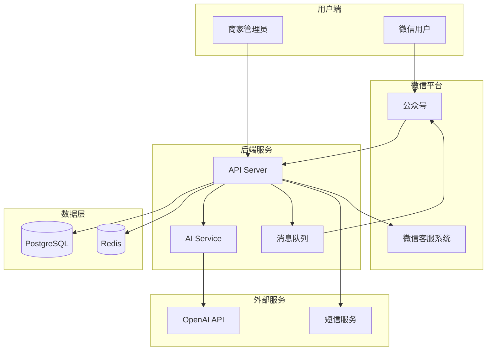

# 产品需求文档 (PRD)

## 微信 AI 客服 SaaS

**产品名称**: WeChatBot / 微信智客 (待定)

**版本**: MVP 1.0

**目标上线**: 4-6 周

---

## 1. 产品概述

### 1.1 产品定位

一款面向小微企业的微信公众号 AI 客服解决方案，帮助商家用 AI 自动回复客户咨询，降低人工客服成本，提升响应速度。

### 1.2 目标用户

- 小微企业主 / 个体商户
- 拥有微信服务号，需要处理客户咨询
- 没有专职客服团队，或客服人力有限
- 预算有限，追求性价比

### 1.3 核心价值

| 用户痛点 | 我们的解决方案 |

|----------|---------------|

| 客服人力成本高 | AI 自动回复 80%+ 常见问题 |

| 响应不及时，客户流失 | 7x24 秒级响应 |

| 不会配置技术 | 零代码接入，5分钟上手 |

| 担心 AI 答错 | 支持随时转人工 |

---

## 2. 功能需求

### 2.1 MVP 核心功能

```
┌─────────────────────────────────────────────────────────────┐
│                     MVP 功能架构                             │
├─────────────────────────────────────────────────────────────┤
│                                                             │
│  ┌─────────────┐    ┌─────────────┐    ┌─────────────┐     │
│  │  公众号接入  │ →  │  AI 自动回复 │ →  │  转人工客服  │     │
│  └─────────────┘    └─────────────┘    └─────────────┘     │
│         │                  │                  │            │
│         ↓                  ↓                  ↓            │
│  ┌─────────────┐    ┌─────────────┐    ┌─────────────┐     │
│  │  管理后台    │    │  对话记录    │    │  数据统计    │     │
│  └─────────────┘    └─────────────┘    └─────────────┘     │
│                                                             │
└─────────────────────────────────────────────────────────────┘
```

#### 功能 1: 公众号接入

**用户故事**: 作为商家，我希望能快速绑定我的公众号，无需复杂配置。

**功能点**:

- 扫码授权绑定公众号 (使用微信开放平台授权)
- 自动配置 Webhook 地址
- 支持服务号和认证订阅号
- 显示绑定状态和基本信息

#### 功能 2: AI 自动回复

**用户故事**: 作为商家，我希望 AI 能自动回答客户的常见问题。

**功能点**:

- 接收用户文本消息
- 调用 AI (GPT-4o-mini) 生成回复
- 通过客服消息 API 发送回复
- 支持设置 AI 人设/角色提示词
- 支持设置欢迎语
- 48小时窗口期内可主动发消息

**AI 配置项**:

```
- 角色名称: "小美客服"
- 角色描述: "我是XX店铺的客服小美，热情、专业、耐心"
- 业务介绍: "我们是一家卖XX的店铺，主营产品有..."
- 回复风格: 专业 / 亲切 / 简洁
- 禁止话题: 政治、竞品等
```

#### 功能 3: 转人工客服

**用户故事**: 作为商家，当 AI 无法解决问题时，我希望能无缝转接人工。

**功能点**:

- 关键词触发转人工 ("人工"、"转人工"、"客服" 等)
- AI 判断需要转人工时主动转接
- 消息转发到微信原生客服系统
- 商家在「公众平台助手」小程序回复
- 人工接管后 AI 暂停该会话

**转人工流程**:

```
用户: "我要退款，转人工"
    ↓
系统: "好的，正在为您转接人工客服，请稍候..."
    ↓
消息进入微信客服队列
    ↓
商家在「公众平台助手」回复
```

#### 功能 4: 管理后台

**用户故事**: 作为商家，我需要一个简单的后台来管理我的 AI 客服。

**功能点**:

- 用户注册/登录 (手机号 + 验证码)
- 公众号绑定管理
- AI 设置 (提示词、风格等)
- 对话记录查看
- 用量统计 (消息数、AI 消耗)
- 套餐管理 / 充值

---

### 2.2 后续版本功能 (V2+)

| 功能 | 优先级 | 说明 |

|------|--------|------|

| 知识库管理 | 高 | 上传文档/FAQ，AI 基于知识库回答 |

| 多公众号管理 | 高 | 一个账号管理多个公众号 |

| 自定义快捷回复 | 中 | 预设常用回复模板 |

| 对话数据分析 | 中 | 热门问题、满意度统计 |

| 图片/语音消息 | 中 | 支持更多消息类型 |

| 自动打标签 | 低 | AI 自动给用户打标签 |

| API 开放 | 低 | 提供 API 给开发者 |

---

## 3. 计费模式

### 3.1 套餐设计

| 套餐 | 月费 | 包含消息数 | 超额价格 | 适合 |

|------|------|-----------|----------|------|

| **免费版** | 0 | 100条/月 | 不可超额 | 试用体验 |

| **基础版** | ¥99 | 3,000条/月 | ¥0.05/条 | 小商户 |

| **专业版** | ¥299 | 10,000条/月 | ¥0.03/条 | 中型商户 |

| **企业版** | ¥999 | 50,000条/月 | ¥0.02/条 | 大客户 |

### 3.2 计费规则

- 一条"消息"= 用户发送一条 + AI 回复一条
- 转人工不计入 AI 消息数
- 月底清零，不累计
- 超额自动按量扣费 (需预充值)

---

## 4. 技术架构

### 4.1 系统架构



### 4.2 技术栈

| 层级 | 技术选型 |

|------|----------|

| 前端 | Next.js 14 + TypeScript + Tailwind CSS |

| 后端 | Node.js + Express / Fastify |

| 数据库 | Supabase (PostgreSQL) |

| 缓存 | Redis (Upstash) |

| AI | OpenAI GPT-4o-mini |

| 部署 | Vercel (前端) + Railway/Render (后端) |

| 支付 | 微信支付 / 支付宝 |

### 4.3 项目结构

```
wechat-ai-saas/
├── frontend/                 # Next.js 前端
│   ├── app/
│   │   ├── (auth)/          # 登录注册
│   │   ├── (dashboard)/     # 管理后台
│   │   └── (marketing)/     # 官网落地页
│   ├── components/
│   └── lib/
├── backend/                  # Node.js 后端
│   ├── src/
│   │   ├── routes/
│   │   ├── services/
│   │   ├── models/
│   │   └── utils/
│   └── package.json
├── shared/                   # 共享类型定义
└── docs/                     # 文档
```

---

## 5. 数据模型

### 5.1 核心表设计

```sql
-- 租户/商家表
CREATE TABLE tenants (
  id UUID PRIMARY KEY,
  name VARCHAR(100),
  phone VARCHAR(20) UNIQUE,
  email VARCHAR(100),
  plan VARCHAR(20) DEFAULT 'free',
  message_quota INTEGER DEFAULT 100,
  message_used INTEGER DEFAULT 0,
  balance DECIMAL(10,2) DEFAULT 0,
  created_at TIMESTAMP DEFAULT NOW()
);

-- 公众号绑定表
CREATE TABLE wechat_accounts (
  id UUID PRIMARY KEY,
  tenant_id UUID REFERENCES tenants(id),
  appid VARCHAR(50) UNIQUE,
  name VARCHAR(100),
  original_id VARCHAR(50),
  access_token TEXT,
  refresh_token TEXT,
  token_expires_at TIMESTAMP,
  webhook_configured BOOLEAN DEFAULT false,
  ai_enabled BOOLEAN DEFAULT true,
  created_at TIMESTAMP DEFAULT NOW()
);

-- AI 配置表
CREATE TABLE ai_configs (
  id UUID PRIMARY KEY,
  wechat_account_id UUID REFERENCES wechat_accounts(id),
  role_name VARCHAR(50) DEFAULT 'AI客服',
  system_prompt TEXT,
  welcome_message TEXT,
  reply_style VARCHAR(20) DEFAULT 'professional',
  human_keywords TEXT[],
  created_at TIMESTAMP DEFAULT NOW()
);

-- 对话记录表
CREATE TABLE conversations (
  id UUID PRIMARY KEY,
  wechat_account_id UUID REFERENCES wechat_accounts(id),
  openid VARCHAR(100),
  session_id VARCHAR(100),
  is_human_mode BOOLEAN DEFAULT false,
  last_message_at TIMESTAMP,
  created_at TIMESTAMP DEFAULT NOW()
);

-- 消息记录表
CREATE TABLE messages (
  id UUID PRIMARY KEY,
  conversation_id UUID REFERENCES conversations(id),
  role VARCHAR(20), -- 'user', 'assistant', 'human', 'system'
  content TEXT,
  tokens_used INTEGER,
  created_at TIMESTAMP DEFAULT NOW()
);
```

---

## 6. 页面设计

### 6.1 页面清单

| 页面 | 路径 | 说明 |

|------|------|------|

| 官网首页 | `/` | 产品介绍、功能展示 |

| 登录 | `/login` | 手机号登录 |

| 注册 | `/register` | 新用户注册 |

| 控制台首页 | `/dashboard` | 数据概览 |

| 公众号管理 | `/dashboard/accounts` | 绑定/管理公众号 |

| AI 设置 | `/dashboard/ai-config` | 配置 AI 参数 |

| 对话记录 | `/dashboard/conversations` | 查看历史对话 |

| 套餐管理 | `/dashboard/billing` | 套餐升级、充值 |

### 6.2 控制台首页 Wireframe

```
┌─────────────────────────────────────────────────────────────┐
│  Logo   公众号管理  AI设置  对话记录  套餐管理     [用户头像] │
├─────────────────────────────────────────────────────────────┤
│                                                             │
│  📊 今日数据                                                │
│  ┌──────────┐  ┌──────────┐  ┌──────────┐  ┌──────────┐   │
│  │   128    │  │   95%    │  │   3.2s   │  │    5     │   │
│  │ 消息总数  │  │ AI处理率 │  │ 平均响应 │  │ 转人工数  │   │
│  └──────────┘  └──────────┘  └──────────┘  └──────────┘   │
│                                                             │
│  📈 消息趋势 (近7天)                                        │
│  ┌─────────────────────────────────────────────────────┐   │
│  │  [折线图: 每日消息数量]                               │   │
│  └─────────────────────────────────────────────────────┘   │
│                                                             │
│  💬 最近对话                                                │
│  ┌─────────────────────────────────────────────────────┐   │
│  │ 用户A  "你们发货多久能到？"           2分钟前  [查看] │   │
│  │ 用户B  "有没有优惠活动？"             15分钟前 [查看] │   │
│  │ 用户C  "我要退款，转人工"             1小时前  [查看] │   │
│  └─────────────────────────────────────────────────────┘   │
│                                                             │
└─────────────────────────────────────────────────────────────┘
```

---

## 7. 开发计划

### 7.1 里程碑

| 阶段 | 时间 | 目标 |

|------|------|------|

| **M1: 基础框架** | 第1周 | 项目搭建、数据库、用户认证 |

| **M2: 公众号接入** | 第2周 | 授权绑定、Webhook 配置 |

| **M3: AI 回复** | 第3周 | AI 服务、消息处理、转人工 |

| **M4: 管理后台** | 第4周 | 对话记录、AI 配置、数据统计 |

| **M5: 计费系统** | 第5周 | 套餐管理、支付、用量统计 |

| **M6: 上线准备** | 第6周 | 测试、优化、部署、文档 |

---

## 8. 下一步行动

确认此 PRD 后，我将：

1. 创建项目文件夹 `wechat-ai-saas/`
2. 初始化前后端项目结构
3. 搭建数据库 schema
4. 开始 M1 阶段开发

是否需要我调整任何部分？